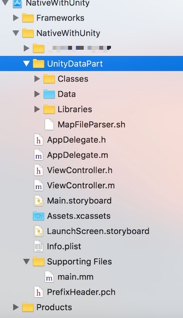
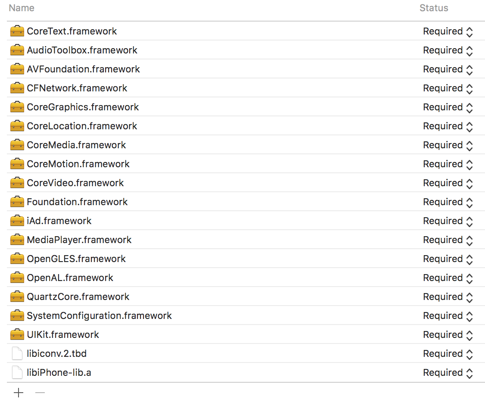
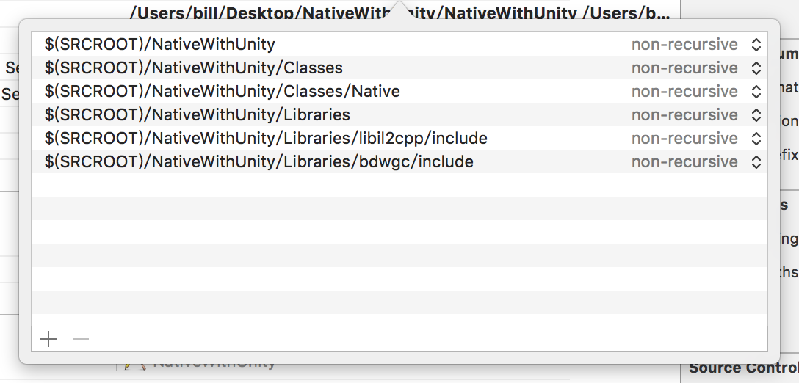
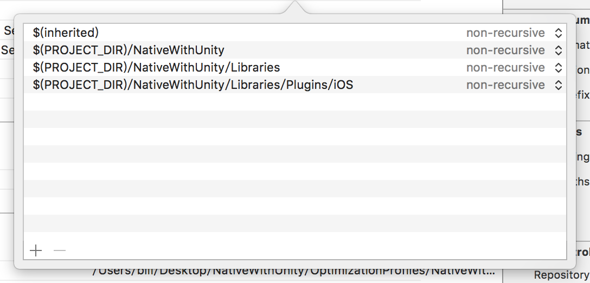
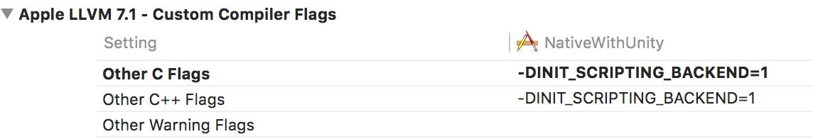
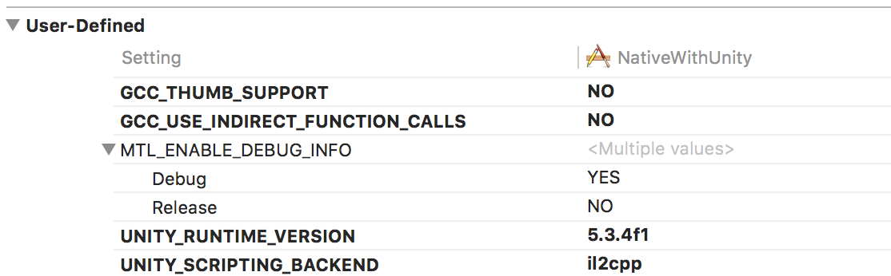
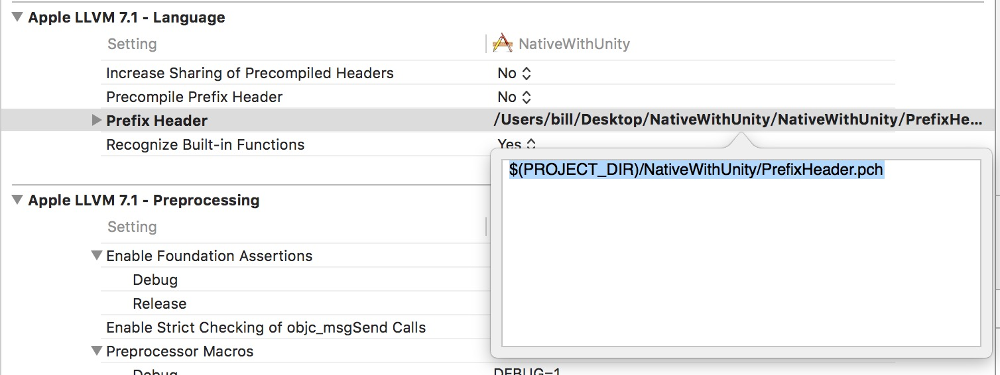
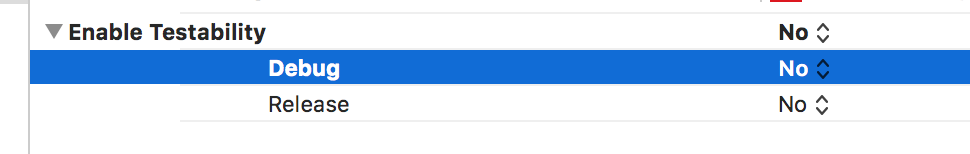

# Unity3D - iOS

> 以原生项目为基础，将导出项目作为模块合并其中；该方法需要添加各类 Unity 的库以及各种配置，较为繁琐  
> 由于此篇文章写在蛮久以前的了，所用的 Unity 版本 和 iOS 的版本都已经大不一样，但理论方法不变，此次将资料整理了一下，记录下～


## 0. 概述
总的来说，Unity 和 iOS 合并其实非项目需求所必要，还是别尝试如此进行合并：  
一是破坏了原生项目的架构，二是 app size 堪忧，unity 的部分至少 20mb，再加上原生项目的体积，可能这个应用也不会有人下载了吧；  

但是实验性质的学习合并两个项目，并且理通顺项目之间的调用关系，对于个人还是有不少帮助的；   

以下内容着重讲解了两个项目的合并过程以及两个运行环境之间的互相调用方法；

## 1. Unity And iOS
##### 1. Unity 导出 Xcode 项目

Unity 导出的 iOS 工程，其中 Class, Data 和 Libaries 文件夹主要是存储资源跟库文件，需要合并到原生项目中的就是这三个文件，并且如果 Unity 项目有改变，每次导出后需要手动替换这三个文件夹；



##### 2. 将 Unity 导出项目合并到原生项目

2.1. 将 Classes, Libraries, MapFileParser.sh 拖入到项目(选中Copy items if needed, 选中Create groups)<br>
将 Data 拖入到项目(选中Copy items if needed, 选中Create folder references)<br>
> 后续的修改，只需要删除旧文件，并替换新的 Classes，Libraries，Data 文件夹即可（拷贝时间较长，请耐心等待）<br>

项目中可以新建 UnityDataPart 用于放置所拷贝的文件；

2.2. 添加必要的库文件(如下)


2.3. 添加 Header Search Paths 和 Library Search Paths

> Header Search Paths<br>
> $(SRCROOT)/[xxxx]<br>
> $(SRCROOT)/[xxxx]/Classes<br>
> $(SRCROOT)/[xxxx]/Classes/Native<br>
> $(SRCROOT)/[xxxx]/Libraries<br>
> $(SRCROOT)/[xxxx]/Libraries/libil2cpp/include<br>
> $(SRCROOT)/[xxxx]/Libraries/bdwgc/include<br>

> * [xxxx] 为项目名，下同




> Library Search Paths<br>
> $(PROJECT_DIR)/[xxxx]<br>
> $(PROJECT_DIR)/[xxxx]/Libraries<br>
> $(PROJECT_DIR)/[xxxx]/Libraries/Plugins/iOS<br>



2.4. other C Flags -> -DINIT_SCRIPTING_BACKEND=1



2.5 添加以下的 User-Defined (其中 UNITY_RUNTIME_VERSION 版本号与导出工程的Unity版本号一致，5.5.0f3)



GCC_THUMB_SUPPORT: NO <br>
GCC_USE_INDIRECT_FUNCTION_CALLS: NO <br>
UNITY_RUNTIME_VERSION: 5.5.0.f3 <br>
UNITY_SCRIPTING_BACKEND: il2cpp <br>

2.6 新建 PrefixHeader.pch，并将 Classes/Prefix.pch 的代码复制到新建的 .pch 文件, 设置pch文件路径



2.7 将 Classes/main.mm（复制完成后删除该文件） 的全部内容复制到原生项目的 main.m，并把扩展名改为.mm

Main.mm 作为整个项目的入口主要做了如下的事情：

	RegisterMonoModules();
    const char* AppControllerClassName = "UnityAppController";

    int main(int argc, char* argv[])
    {
	   @autoreleasepool
	   {
		    UnityInitTrampoline();
		    UnityParseCommandLine(argc, argv);

		    NSLog(@"-> registered mono modules %p\n", &constsection);
	    	RegisterFeatures();

		   // iOS terminates open sockets when an application enters background mode.
		   // The next write to any of such socket causes SIGPIPE signal being raised,
		   // even if the request has been done from scripting side. This disables the
		   // signal and allows Mono to throw a proper C# exception.
		    std::signal(SIGPIPE, SIG_IGN);

		  UIApplicationMain(argc, argv, nil, [NSString stringWithUTF8String:AppControllerClassName]);
    	}
	   return 0;
    }

+ 初始化各个模块
+ 将 UnityAppController 作为控制类来实现 Unity 在 iOS 上显示的功能；换句话说，就是在 main 之后紧接着就要执行这个类里面的函数

2.8 其他设置

+ 修改bit code 为 NO
+ 修改 BuildSettting 中的 EnableTestability 为 No；（该操作针对 Xcode8 环境下编译的情况， Xcode7 默认为 No）



##### 3. 添加与 Unity 交互的文件

经过上面的步骤后，可以尝试编译运行项目，此时项目走的加载逻辑应该就如 Unity 直接导出 iOS 项目一样，自动运行 Unity 了；  

> 糟糕了，那原生项目的代码怎么办？ 

其实也很简单，由于 main.mm 的加载是可控的，就说明 Unity 的部分如何加载其实也只是看我们代码怎么写了；这里总结了一个办法，代码可以看 github 项目内的文件；  

只需要将 NativeFolder 文件夹拖拉添加到 Xcode 项目中即可；

##### 4. NativeFolder

+ CustomUnityAppController<br>
该类继承于 UnityAppController，用于改变 Unity 导出项目自动执行 Unity Scene 的逻辑；改为可先加载 iOS 原生界面；
> 注意：IMPL_APP_CONTROLLER_SUBCLASS(CustomUnityAppController)这个方法可以修改了 UnityAppController 的初始化，使其载入子类，而非父类；

+ EnterUnityViewController<br>
该类为原生界面，内包含了关于 Unity 的使用与跳转逻辑等，作为如何从原生界面跳转入 Unity 界面的例子；

+ UnityCallNativeEventCollection<br>
该类内放置着所有可供 Unity 项目内 C# 脚本可调用的函数；

+ NativeUnityDataManager<br>
该类存储了在使用 Unity 模块与原生项目交互时所需的数据；

##### 5. 合并说明

经过以上的合并之后，运行编译即可。<br>
应用启动后，将进入 HomeViewController 的界面，然后进行其它操作；若原生项目包含 StoryBoard，可通过修改 CustomUnityAppController 的初始化逻辑，使其自动进入 StoryBoard 界面逻辑；

	- (void)startUnity:(UIApplication *)application {
	    
	    //判断是否加载到HomeView，bool值作为全局变量存放在单例中
	     if(![NativeUnityDataManager instance].isInNativeView) {
	        
	        // 进入 xib 界面
	        //viewController = [HomeViewController new];
	        
	        // 进入 Storyboard 界面
	         UIStoryboard *story = [UIStoryboard storyboardWithName:@"Main" bundle:nil];
	         viewController = [story instantiateInitialViewController];
	         
	        //将当前window的rootViewController变成自定义的VC，实现入口的修改
	        self.window.rootViewController = viewController;
	        [NativeUnityDataManager instance].customUnityAppDelegate = self;
	        
	        //将当前window也作为全局变量存放在单例中
	        [NativeUnityDataManager instance].window = self.window;
	         
	    } else {
	        
	        //启动unity
	        [super startUnity:application];
	    }
	}
## 2. Unity Call iOS Native Functions

Unity 调用 iOS 中原生部分的代码，需要进行两个配置：<br>
1. Unity 项目中声明方法；<br>
2. iOS 原生部分声明并实现该函数；<br>

##### 1. Unity 项目中声明方法
在 C# 脚本中声明方法（该方法同时也在 iOS 中实现了）

	#if UNITY_IPHONE
	[DllImport("__Internal")]
	private static extern int _unityCalliOSNativeEvent(string title, string msg);
	#endif	

	void OnGUI() {
		if(GUI.Button(new Rect(200,10,100,30), "Click")) {
			_unityCalliOSNativeEvent("Unity Call iOS", "show message");
		}
	}

##### 2. iOS 原生部分声明与实现函数

将 NativeFolder 文件夹拖拉添加到 Xcode 项目中；

声明与实现函数，供 Unity3D 脚本调用；

```
#if defined(__cplusplus)
extern "C" {
#endif
void _unityCalliOSNativeEvent(const char *title, const char *msg){
	UIAlertView *alert =[[UIAlertView alloc] init];
   	[alert setTitle:[NSString stringWithUTF8String:title]];
   	[alert setMessage:[NSString stringWithUTF8String:msg]];
   	[alert addButtonWithTitle:@"确定"];
   	[alert show];
}
#if defined(__cplusplus)
}
#endif
```
> 在函数集中添加到 UnityCallNativeEventCollection 类中；


## 3. iOS Native Call Unity C# Functions

##### 1. Unity 底层方法
	void UnitySendMessage(const char* obj, const char* method, const char* msg);
	
> obj: 必须为当前场景中的对象<br>
> method: obj 上所挂脚本中所包含的函数名<br>
> msg: 参数<br>

使用以上方法，即可调用 C# 脚本函数；

如在 Unity 有一个 Object 为 `NativeEventCallerListener`，它挂载的脚本中有函数 `Unity_Message_Event`:

    const char *result = [@"test" UTF8String];
	UnitySendMessage("NativeEventCallerListener", "Unity_Message_Event", result);


## 4. 其他
还有些小细节需要注意下  

+ EnterUnityViewController.startUnity 函数第一次调用则初始化并启动 Unity 部分，重复调用不再初始化 Unity；
+ ...
